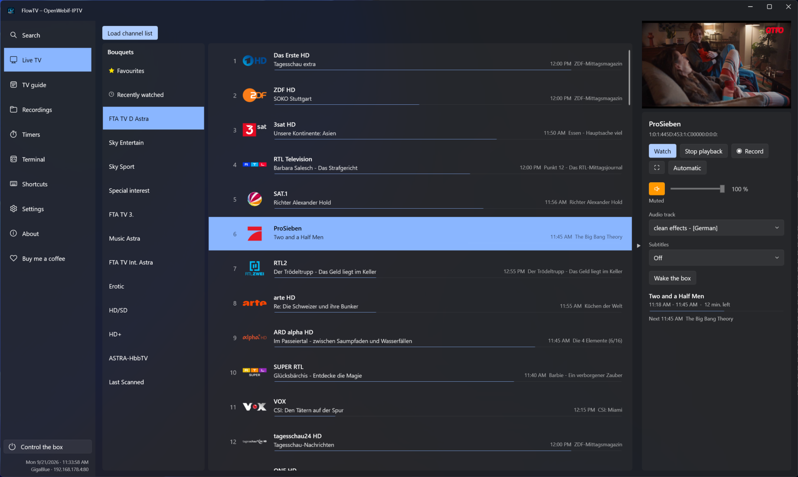
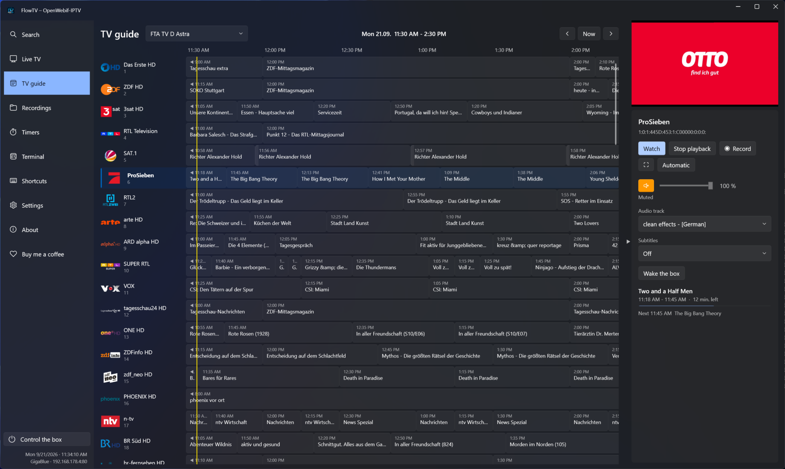
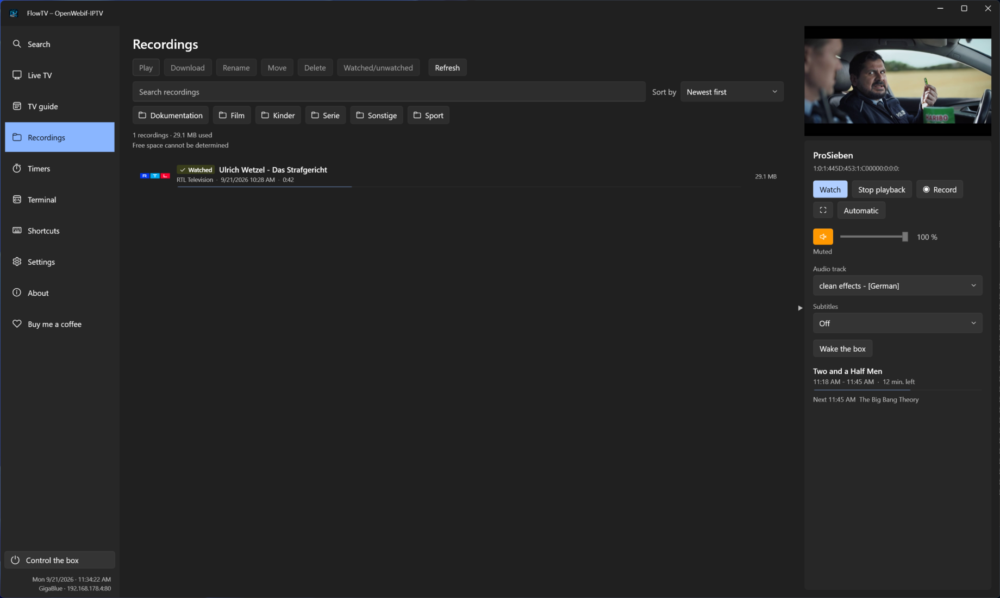
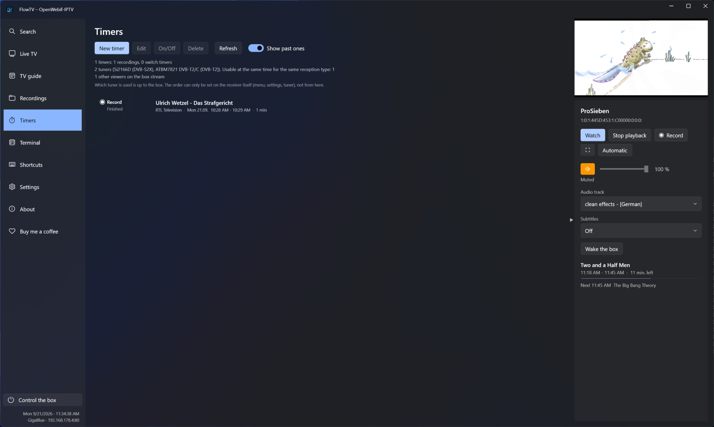
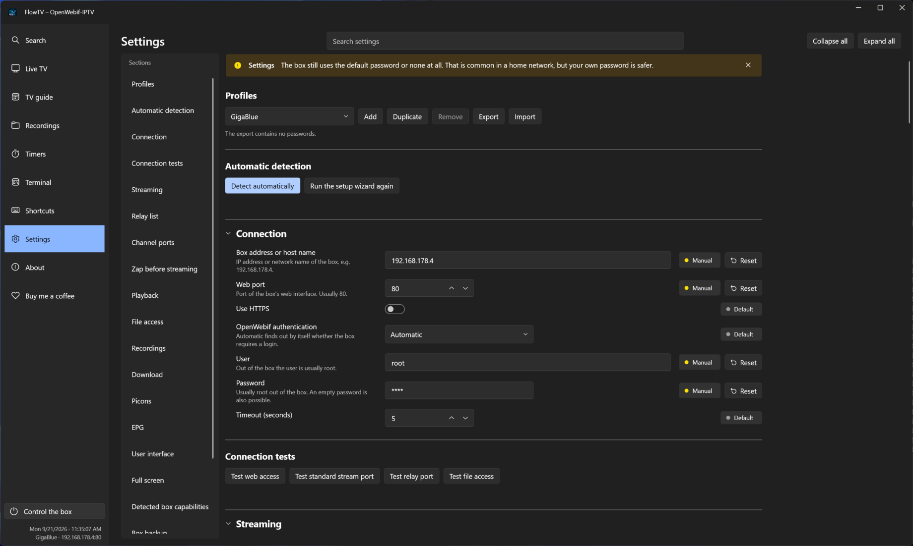
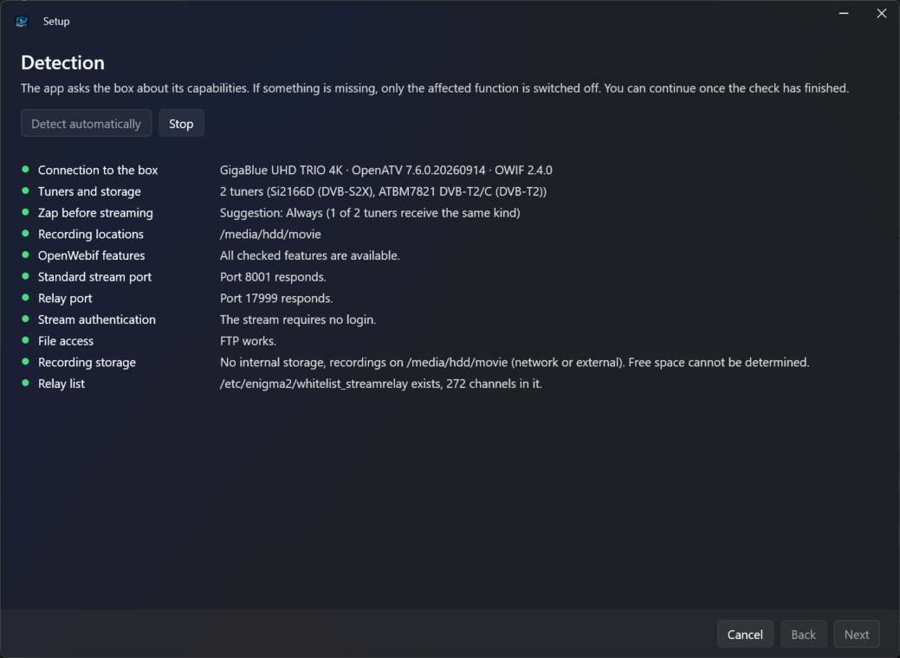

<div align="center">


**Client for Enigma2 receivers over OpenWebif – Windows, plus Linux and Mac as previews**

[Deutsch](#deutsch) · [English](#english) · [Download](../../releases/latest)

</div>

---

## English

FlowTV turns a PC into a second TV set for an Enigma2 receiver. It talks
to the box over **OpenWebif**, shows your own channel lists with picons, the
programme guide, live TV, timers and recordings – and it never shows a black
screen while switching channels.



### What it does

- **Channel lists with picons**, straight from your box. Favourites and a
  “recently watched” list live on the PC, so they are there even when the box is
  off.
- **Live TV** through LibVLC, with the standard port and the stream relay port
  for encrypted channels; if one does not answer, the other is used.
- **Programme guide** with a grid, a detail card and a search over all channels.
- **Timers**: record or just switch over at the start of a programme, with tuner
  conflict detection – it will not start something that would break a running
  recording.
- **Recordings**: watch with resume, download over FTP/SFTP/HTTP with a queue,
  rename, move, delete.
- **Box control**: standby, restart, shutdown, a terminal with prepared commands
  and a backup of the box settings.
- **Dark, TiviMate-like interface**, German and English, adjustable font size and
  freely assignable keys.

### Why 2.0 – and why it was rebuilt

FlowTV 1.0 was built on WPF, Microsoft's interface technology that only exists
on Windows. For 2.0 the whole interface was **rebuilt on Avalonia**, which runs
on Windows, Linux and macOS from one and the same code. What stays the same:
the functions, the look, your settings. What changes: the same FlowTV can now
also run on **Linux** and the **Mac** (from 2.0, both as previews) – without
three separate programs that would drift apart.

On the way, many things from everyday use got better – see the
[changelog](CHANGELOG.md).

### A look inside

|  |  |
|---|---|
|  |  |
| **Programme guide** – grid, “now” jump, the running programme marked | **Recordings** – watch with resume, download, rename, move |
|  |  |
| **Timers** – recording and switch timers, with what the tuners allow | **Settings** – everything adjustable, and every value says where it came from |

The setup wizard on the very first start searches the network, asks for the
login and then asks the box what it can do:



*The pictures show the English interface; the app speaks German as well.*

### Download and start

1. Get the latest `FlowTV-<version>-win-x64.zip` from the
   [Releases page](../../releases/latest). *(Linux and Mac: see
   [below](#linux-preview).)*
2. Unpack it to any folder – for example `C:\Programme\FlowTV`. **Do not run it
   from inside the ZIP.**
3. Start `FlowTV.exe`.

**Windows will warn you on the first start** (“Windows protected your PC”). The
program is not code-signed – a certificate costs money that this project does not
have. Click **More info** and then **Run anyway**. If you would rather not, that
is a legitimate decision; the warning says nothing about what the program does.

**Windows Firewall** will ask for network access on the first start. FlowTV needs
it for **private networks** – that is where your receiver is.

**The first start can take a little longer.** That is Windows, not FlowTV:
playback is done by LibVLC, which brings around 270 plugin files, and Windows
Defender looks at every one of them once. Measured: a few seconds up to half a
minute for files it does not know yet, depending on the PC, and **0.3 seconds**
once it does. The window itself is there immediately and can be used; only the
picture waits.

If it bothers you, adding the FlowTV folder to the Defender exclusions makes it
quick every time – that is your decision, and the program works fine without
it.

**Updating from 1.0:** unpack the new ZIP into a new folder and start
`FlowTV.exe`. Settings, profiles, favourites and key bindings live in
`%AppData%\FlowTV` and carry over. Delete the old folder afterwards.

### Linux (preview)

Since 2.0 there is a Linux version: `FlowTV-<version>-linux-x64.tar.gz` on the
[Releases page](../../releases/latest). It needs a 64-bit PC (x64) with a normal
desktop (X11, or Wayland with XWayland – the default on current distributions).

**1. Install VLC.** On Linux, FlowTV uses the VLC of your system instead of
bringing its own – that way your distribution keeps it up to date.

| Distribution | Command |
|---|---|
| Ubuntu, Debian, Linux Mint | `sudo apt install vlc` |
| Fedora | enable [RPM Fusion](https://rpmfusion.org/Configuration), then `sudo dnf install vlc` |
| Arch, Manjaro | `sudo pacman -S vlc vlc-plugins-all` |
| openSUSE | `sudo zypper install vlc` (all codecs via [Packman](https://en.opensuse.org/Additional_package_repositories#Packman)) |

Without VLC, FlowTV starts anyway and tells you exactly this, with the command.

**2. Optional: keyring for passwords.** FlowTV encrypts the passwords for your
box. The key goes to the desktop's keyring (GNOME Keyring, KWallet) via
`secret-tool`; on Ubuntu/Debian that is `sudo apt install libsecret-tools`.
Without it, the key is kept in a file only you can read – that works too.

**3. Unpack and start** – in a terminal, in the folder with the download:

```
tar xzf FlowTV-<version>-linux-x64.tar.gz
cd FlowTV-<version>-linux-x64
./FlowTV
```

**4. Optional: a launcher in the menu.** Save this as
`~/.local/share/applications/flowtv.desktop` and adjust the path to where you
unpacked FlowTV:

```
[Desktop Entry]
Type=Application
Name=FlowTV
Comment=Enigma2 receiver over OpenWebif
Exec=/home/YOUR-NAME/FlowTV-<version>-linux-x64/FlowTV
Icon=/home/YOUR-NAME/FlowTV-<version>-linux-x64/flowtv.png
Categories=AudioVideo;Video;TV;
```

Settings live in `~/.config/FlowTV`. **Updating:** unpack the new version and
start it – the settings stay where they are.

**Honestly: it is a preview.** It was tested on **Ubuntu 24.04 in WSL2** (the
Linux inside Windows) against the same box: setup, channel list, picture,
switching, guide – all fine. **Sound under WSL stutters** – plain VLC does the
same there, it is WSL's sound bridge, not FlowTV. On a real Linux PC it has not
been tested yet, nor on the other distributions in the table. Reports are very
welcome.

### Mac (preview, untested)

Since 2.0 there is also a Mac version: `FlowTV-<version>-osx-x64.tar.gz` on the
[Releases page](../../releases/latest).

**Honestly first: nobody has run it on a real Mac yet.** It is built from the
same code as the Windows and Linux versions, and its parts have been checked –
but there is no Mac here. It may not start at all. If you try it, please tell us
how it went (see below).

**What you need**

- macOS 13 (Ventura) or later.
- Intel or Apple silicon (M1–M4): it is an **Intel build**, because LibVLC for the
  Mac only exists for Intel as a package. On Apple silicon it runs through
  **Rosetta 2** – if that is missing, the Mac offers to install it on the first
  start, or in Terminal: `softwareupdate --install-rosetta --agree-to-license`
- Nothing else: VLC and .NET are inside the app.

**Install and start**

1. Double-click the `.tar.gz` in Finder. You get a folder with `FlowTV.app`.
2. Drag `FlowTV.app` into **Applications**.
3. **The first start is blocked by macOS**, because the app is not signed by
   Apple (that costs money this project does not have). Two ways past it:
   - In **Terminal** (always works):
     `xattr -dr com.apple.quarantine /Applications/FlowTV.app` – then start
     FlowTV normally.
   - Or: double-click, cancel the warning, then **System Settings → Privacy &
     Security**, scroll down, **Open Anyway**.

   “FlowTV is damaged and can’t be opened” is the same block in other words –
   the Terminal line helps.
4. Allow **“find devices on your local network”** – without it FlowTV cannot
   reach your receiver. Later, allow access to the **keychain**: FlowTV keeps the
   key for your box password there.

Settings live in `~/.config/FlowTV` (in Finder: Go → Go to Folder, Cmd+Shift+G).
Keys work as on Windows (F, Esc, arrows, M, S …); the Cmd key is not specially
handled yet.

**Please report back** in an [issue](../../issues): your Mac model, chip and
macOS version, what worked and what did not, and the **diagnostics export**
(Settings → Diagnostics → Export diagnostics). If it does not start at all: the
files in `~/.config/FlowTV/logs` and a screenshot of the error.

### What you need

**On the PC – nothing to install beforehand:**

- 64-bit Windows 10 or 11.
- No .NET: the runtime is inside the folder.
- No VLC: LibVLC ships as its own DLLs in the `libvlc` subfolder.
- No Visual C++ redistributable.
- *Linux: 64-bit (x64) and VLC from the package manager – see above.*
- *Mac: macOS 13 or later; on Apple silicon Rosetta 2 – see above.*

**On the receiver:**

- **OpenWebif must be running** and reachable – without it, nothing works.
- **SSH** (Dropbear or OpenSSH) for the terminal and the settings backup.
- **FTP or SFTP** for downloading recordings.
- For encrypted channels over a stream relay: the relay service and its list at
  `/etc/enigma2/whitelist_streamrelay`.

Whatever is missing simply stays greyed out and says why – the rest keeps
working.

### First start

A short wizard searches the local network for boxes, asks for the login and
detects what your box can do. Everything it finds can be overridden by hand, and
every value shows where it came from: default, detected or set by you.

### Tested on one box only – please read this

This project has one developer and one receiver. **Everything you see was tested
on a GigaBlue UHD TRIO 4K with openATV 7.6 and OpenWebif 2.4.**

- **Receivers with several tuners could not be tested.** The most delicate part
  sits exactly there: counting tuners per reception type, comparing
  transponders, and protecting a running recording. That logic is covered by
  automated tests and written defensively, but nobody has watched it run on real
  hardware with more than one tuner.
- **Other images** (VTi, OpenPLi, PurE2 …) are untested. The app parses
  defensively and greys out what a box cannot do – that is what it is built for,
  but it is not proven.

**Bug reports are very welcome, especially from other boxes.** Please open an
[issue](../../issues) and attach the **diagnostics export** (Settings →
Diagnostics): it anonymises credentials and contains exactly the answers of your
box that are needed to understand the problem.

And the honest part: a bug that only happens on a box that is not standing here
may not be reproducible, and then it cannot be fixed with certainty. Please
report it anyway – several reports about the same box make a pattern.

### Support the project

FlowTV is made in spare time and is free for you. If you would like to support
it, there is a **coffee fund**:

- [Ko-fi](https://ko-fi.com/the_flow)
- [Revolut](https://revolut.me/the_flow)

Crypto addresses (BTC, ETH, SOL, XRP) are inside the app under **Buy me a
coffee**, with copy buttons and QR codes – so there is only one place where they
are kept, and it cannot go out of sync.

Feedback is worth just as much as money: bugs and ideas are what the next
version is made of.

### License

The program code is **proprietary** – see [LICENSE.txt](LICENSE.txt). It is not
open source, and this repository contains no source code.

The app ships third-party software; name, version, license and project page of
every component are listed in
[THIRD-PARTY-NOTICES.txt](THIRD-PARTY-NOTICES.txt), the full license texts are in
[licenses](licenses). In particular **LibVLC is used under LGPL-2.1-or-later**:
its files are separate, replaceable libraries in the `libvlc` subfolder next to
the program – neither statically linked nor bundled – and can be exchanged for
another build. Sources: <https://code.videolan.org/videolan/vlc>. On Linux,
FlowTV uses the VLC installed on the system and ships none. On the Mac, LibVLC is
the separate file `libvlc.dylib` inside `FlowTV.app/Contents/MacOS`.

FlowTV ships **no channel lists, picons or programme data**. Everything you see
comes from your own receiver.

### Not affiliated

FlowTV is an independent work. It is **not officially affiliated with the
OpenWebif project, with VideoLAN, or with any receiver manufacturer**, and is
neither endorsed nor reviewed by them. Names and trademarks mentioned belong to
their respective owners and are used only to describe the interface.

---

## Deutsch

FlowTV macht aus einem PC einen zweiten Fernseher für einen
Enigma2-Receiver. Es spricht über **OpenWebif** mit der Box, zeigt deine eigenen
Senderlisten mit Picons, die Programmzeitschrift, Live-TV, Timer und Aufnahmen –
und beim Umschalten gibt es nie ein schwarzes Bild.


### Was es kann

- **Senderlisten mit Picons**, direkt von der Box. Favoriten und „zuletzt
  gesehen" liegen auf dem PC und sind auch da, wenn die Box aus ist.
- **Live-TV** über LibVLC, mit Standardport und Stream-Relay-Port für
  verschlüsselte Sender; antwortet der eine nicht, wird der andere genommen.
- **TV-Guide** mit Raster, Detailkarte und Suche über alle Sender.
- **Timer**: aufnehmen oder zur Sendezeit nur umschalten, mit Erkennung von
  Tuner-Konflikten – es wird nichts gestartet, was eine laufende Aufnahme
  abbrechen würde.
- **Aufnahmen**: ansehen mit Fortsetzen, herunterladen über FTP/SFTP/HTTP mit
  Warteschlange, umbenennen, verschieben, löschen.
- **Box-Steuerung**: Standby, Neustart, Ausschalten, ein Terminal mit
  vorbereiteten Befehlen und eine Sicherung der Box-Einstellungen.
- **Dunkle, TiviMate-ähnliche Oberfläche**, Deutsch und Englisch, einstellbare
  Schriftgröße und frei belegbare Tasten.

### Warum 2.0 – und warum neu gebaut

FlowTV 1.0 war mit WPF gebaut, Microsofts Oberflächentechnik, die es nur unter
Windows gibt. Für 2.0 ist die ganze Oberfläche **auf Avalonia neu gebaut**
worden – das läuft unter Windows, Linux und macOS aus ein und demselben Code.
Was bleibt: die Funktionen, das Aussehen, deine Einstellungen. Was sich ändert:
Dasselbe FlowTV läuft jetzt auch auf **Linux** und dem **Mac** (ab 2.0, beide
als Vorschau) – ohne drei getrennte Programme, die auseinanderlaufen.

Nebenbei ist vieles aus dem Alltag besser geworden – siehe die
[Änderungen](CHANGELOG.md).

### Ein Blick hinein

|  |  |
|---|---|
|  |  |
| **TV-Guide** – Raster, Sprung auf „jetzt", die laufende Sendung markiert | **Aufnahmen** – ansehen mit Fortsetzen, herunterladen, umbenennen, verschieben |
|  |  |
| **Timer** – Aufnahme- und Umschalt-Timer, mit dem, was die Tuner hergeben | **Einstellungen** – alles einstellbar, und bei jedem Wert steht, woher er kommt |

Der Einrichtungsassistent beim allerersten Start sucht im Netzwerk, fragt nach
der Anmeldung und fragt dann die Box, was sie kann:


*Die Bilder zeigen die englische Oberfläche; die App spricht genauso Deutsch.*

### Herunterladen und starten

1. Die neueste `FlowTV-<Version>-win-x64.zip` von der
   [Releases-Seite](../../releases/latest) holen. *(Linux und Mac: siehe
   [unten](#linux-vorschau).)*
2. In einen beliebigen Ordner **entpacken** – zum Beispiel
   `C:\Programme\FlowTV`. **Nicht aus der ZIP heraus starten.**
3. `FlowTV.exe` starten.

**Windows warnt beim ersten Start** („Der Computer wurde durch Windows
geschützt"). Das Programm ist nicht signiert – ein Zertifikat kostet Geld, das
dieses Projekt nicht hat. Auf **Weitere Informationen** und dann **Trotzdem
ausführen** klicken. Wer das nicht möchte, hat gute Gründe; die Warnung sagt
nichts darüber aus, was das Programm tut.

**Die Windows-Firewall** fragt beim ersten Start nach Netzwerkzugriff. FlowTV
braucht ihn für **private Netzwerke** – dort steht dein Receiver.

**Der erste Start kann etwas länger dauern.** Das ist Windows und nicht
FlowTV: Die Wiedergabe übernimmt LibVLC, das rund 270 Plugin-Dateien mitbringt,
und der Windows Defender sieht sich jede einmal an. Gemessen: je nach PC ein
paar Sekunden bis eine halbe Minute für Dateien, die er noch nicht kennt, und
**0,3 Sekunden**, sobald er sie kennt. Das Fenster ist sofort da und lässt sich
bedienen; nur das Bild lässt auf sich warten.

Wen es stört, der nimmt den FlowTV-Ordner in die Ausnahmen des Defenders auf –
das ist deine Entscheidung, und ohne funktioniert das Programm genauso.

**Update von 1.0:** Die neue ZIP in einen neuen Ordner entpacken und
`FlowTV.exe` starten. Einstellungen, Profile, Favoriten und Tastenbelegung
liegen unter `%AppData%\FlowTV` und werden übernommen. Den alten Ordner danach
löschen.

### Linux (Vorschau)

Seit 2.0 gibt es eine Linux-Fassung: `FlowTV-<Version>-linux-x64.tar.gz` auf der
[Releases-Seite](../../releases/latest). Gebraucht wird ein 64-Bit-PC (x64) mit
einem gewöhnlichen Desktop (X11, oder Wayland mit XWayland – bei aktuellen
Distributionen der Normalfall).

**1. VLC installieren.** Unter Linux nutzt FlowTV das VLC deines Systems, statt
ein eigenes mitzubringen – so hält es deine Distribution aktuell.

| Distribution | Befehl |
|---|---|
| Ubuntu, Debian, Linux Mint | `sudo apt install vlc` |
| Fedora | [RPM Fusion](https://rpmfusion.org/Configuration) einschalten, dann `sudo dnf install vlc` |
| Arch, Manjaro | `sudo pacman -S vlc vlc-plugins-all` |
| openSUSE | `sudo zypper install vlc` (alle Codecs über [Packman](https://en.opensuse.org/Additional_package_repositories#Packman)) |

Ohne VLC startet FlowTV trotzdem und sagt genau das, samt Befehl.

**2. Optional: Schlüsselbund für die Passwörter.** FlowTV verschlüsselt die
Passwörter für deine Box. Der Schlüssel kommt in den Schlüsselbund des Desktops
(GNOME-Schlüsselbund, KWallet) über `secret-tool`; unter Ubuntu/Debian ist das
`sudo apt install libsecret-tools`. Ohne liegt der Schlüssel in einer Datei, die
nur du lesen kannst – das geht auch.

**3. Entpacken und starten** – im Terminal, im Ordner mit dem Download:

```
tar xzf FlowTV-<Version>-linux-x64.tar.gz
cd FlowTV-<Version>-linux-x64
./FlowTV
```

**4. Optional: ein Starter im Menü.** Das hier als
`~/.local/share/applications/flowtv.desktop` speichern und den Pfad an den Ort
anpassen, an dem FlowTV entpackt liegt:

```
[Desktop Entry]
Type=Application
Name=FlowTV
Comment=Enigma2-Receiver über OpenWebif
Exec=/home/DEIN-NAME/FlowTV-<Version>-linux-x64/FlowTV
Icon=/home/DEIN-NAME/FlowTV-<Version>-linux-x64/flowtv.png
Categories=AudioVideo;Video;TV;
```

Die Einstellungen liegen unter `~/.config/FlowTV`. **Update:** die neue Fassung
entpacken und starten – die Einstellungen bleiben, wo sie sind.

**Ehrlich gesagt: eine Vorschau.** Geprüft wurde sie unter **Ubuntu 24.04 in
WSL2** (dem Linux in Windows) an derselben Box: Einrichtung, Senderliste, Bild,
Umschalten, TV-Guide – alles in Ordnung. **Der Ton hakt unter WSL** – das
normale VLC tut dort dasselbe, es liegt an der Tonbrücke von WSL, nicht an
FlowTV. Auf einem echten Linux-PC ist sie noch nicht geprüft, ebenso wenig auf
den übrigen Distributionen der Tabelle. Rückmeldungen sind sehr willkommen.

### Mac (Vorschau, ungetestet)

Seit 2.0 gibt es auch eine Mac-Fassung: `FlowTV-<Version>-osx-x64.tar.gz` auf der
[Releases-Seite](../../releases/latest).

**Vorweg ehrlich: Auf einem echten Mac ist sie noch nie gelaufen.** Sie entsteht
aus demselben Code wie die Windows- und die Linux-Fassung, und ihre Bestandteile
sind geprüft – aber hier steht kein Mac. Es kann sein, dass sie gar nicht
startet. Wer sie ausprobiert: Bitte sag, wie es gelaufen ist (siehe unten).

**Was du brauchst**

- macOS 13 (Ventura) oder neuer.
- Intel oder Apple-Chip (M1–M4): Es ist ein **Intel-Build**, weil es LibVLC für
  den Mac nur für Intel als Paket gibt. Auf Apple-Chip läuft es über
  **Rosetta 2** – fehlt es, bietet der Mac beim ersten Start die Installation an,
  oder im Terminal: `softwareupdate --install-rosetta --agree-to-license`
- Sonst nichts: VLC und .NET stecken in der App.

**Installieren und starten**

1. Die `.tar.gz` im Finder doppelklicken. Es entsteht ein Ordner mit
   `FlowTV.app`.
2. `FlowTV.app` in **Programme** ziehen.
3. **Den ersten Start blockiert macOS**, weil die App nicht bei Apple signiert
   ist (das kostet Geld, das dieses Projekt nicht hat). Zwei Wege daran vorbei:
   - Im **Terminal** (geht immer):
     `xattr -dr com.apple.quarantine /Applications/FlowTV.app` – danach FlowTV
     ganz normal starten.
   - Oder: doppelklicken, die Warnung abbrechen, dann **Systemeinstellungen →
     Datenschutz & Sicherheit**, nach unten scrollen, **Dennoch öffnen**.

   „FlowTV ist beschädigt und kann nicht geöffnet werden" ist dieselbe Sperre in
   anderen Worten – die Zeile im Terminal hilft.
4. **„Geräte im lokalen Netzwerk finden"** erlauben – ohne das erreicht FlowTV
   deinen Receiver nicht. Später den Zugriff auf den **Schlüsselbund** erlauben:
   Dort legt FlowTV den Schlüssel für das Passwort deiner Box ab.

Die Einstellungen liegen unter `~/.config/FlowTV` (im Finder: Gehe zu → Gehe zum
Ordner, Cmd+Shift+G). Die Tasten sind wie unter Windows (F, Esc, Pfeile, M, S …);
die Cmd-Taste ist noch nicht besonders berücksichtigt.

**Bitte melde dich** in einem [Issue](../../issues): Mac-Modell, Chip und
macOS-Version, was ging und was nicht, und den **Diagnose-Export**
(Einstellungen → Diagnose → Diagnosedaten exportieren). Startet FlowTV gar
nicht: die Dateien in `~/.config/FlowTV/logs` und ein Bildschirmfoto der
Meldung.

### Was du brauchst

**Auf dem PC – nichts vorinstallieren:**

- 64-Bit-Windows 10 oder 11.
- Kein .NET: Die Laufzeit liegt im Ordner.
- Kein VLC: LibVLC liegt als eigene DLL-Sammlung im Unterordner `libvlc`.
- Kein Visual C++ Redistributable.
- *Linux: 64 Bit (x64) und VLC aus der Paketverwaltung – siehe oben.*
- *Mac: macOS 13 oder neuer; auf Apple-Chip Rosetta 2 – siehe oben.*

**Auf der Box:**

- **OpenWebif muss laufen** und erreichbar sein – ohne das geht gar nichts.
- **SSH** (Dropbear oder OpenSSH) für das Terminal und die Einstellungssicherung.
- **FTP oder SFTP** zum Herunterladen von Aufnahmen.
- Für verschlüsselte Sender über ein Stream-Relay: der Relay-Dienst und seine
  Liste unter `/etc/enigma2/whitelist_streamrelay`.

Was fehlt, bleibt ausgegraut und erklärt sich – der Rest läuft weiter.

### Der erste Start

Ein kurzer Assistent sucht im Netzwerk nach Boxen, fragt nach der Anmeldung und
erkennt, was deine Box kann. Alles Erkannte lässt sich von Hand überschreiben,
und bei jedem Wert steht, woher er kommt: Standard, erkannt oder selbst gesetzt.

### Geprüft nur an einer Box – bitte lesen

Hinter diesem Projekt stehen ein Entwickler und ein Receiver. **Alles, was du
hier siehst, ist an einer GigaBlue UHD TRIO 4K mit openATV 7.6 und OpenWebif 2.4
geprüft worden.**

- **Receiver mit mehreren Tunern konnten nicht geprüft werden.** Genau dort
  sitzt der empfindlichste Teil: die Tunerzählung nach Empfangsart, der
  Transpondervergleich und der Schutz einer laufenden Aufnahme. Diese Logik ist
  mit automatischen Tests abgedeckt und defensiv gebaut, aber an echter Hardware
  mit mehreren Tunern hat sie niemand laufen sehen.
- **Andere Images** (VTi, OpenPLi, PurE2 …) sind ungeprüft. Die App parst
  defensiv und graut aus, was eine Box nicht kann – dafür ist sie gebaut,
  bewiesen ist es nicht.

**Fehlermeldungen sind ausdrücklich willkommen, gerade von anderen Boxen.**
Bitte ein [Issue](../../issues) aufmachen und den **Diagnose-Export** anhängen
(Einstellungen → Diagnose): Er anonymisiert Zugangsdaten und enthält genau die
Antworten deiner Box, die zum Verstehen nötig sind.

Und der ehrliche Teil: Ein Fehler, der nur an einer Box auftritt, die hier nicht
steht, lässt sich womöglich nicht nachstellen und damit nicht sicher beheben.
Melde ihn trotzdem – aus mehreren Meldungen zur selben Box wird ein Muster.

### Das Projekt unterstützen

FlowTV entsteht in der Freizeit und ist für dich kostenlos. Wer es unterstützen
möchte, findet hier die **Kaffeekasse**:

- [Ko-fi](https://ko-fi.com/the_flow)
- [Revolut](https://revolut.me/the_flow)

Die Krypto-Adressen (BTC, ETH, SOL, XRP) stehen **in der App** unter **Kaffee
spendieren**, mit Kopierknöpfen und QR-Codes – so gibt es für sie nur eine
Stelle, und die kann nicht auseinanderlaufen.

Eine Rückmeldung ist genauso viel wert wie Geld: Fehler und Ideen sind das,
woraus die nächste Version entsteht.

### Lizenz

Der Programmcode ist **proprietär** – siehe [LICENSE.txt](LICENSE.txt). Er steht
nicht unter einer Open-Source-Lizenz, und dieses Repository enthält keinen
Quelltext.

Die App liefert Software Dritter mit; Name, Version, Lizenz und Projektseite
jedes Bestandteils stehen in
[THIRD-PARTY-NOTICES.txt](THIRD-PARTY-NOTICES.txt), die vollständigen
Lizenztexte im Ordner [licenses](licenses). Insbesondere wird **LibVLC unter der
LGPL-2.1-or-later** verwendet: Die Dateien liegen als eigene, austauschbare
Bibliotheken im Unterordner `libvlc` neben dem Programm – weder statisch
eingebunden noch zusammengepackt – und lassen sich gegen eine andere Version
tauschen. Quelltexte: <https://code.videolan.org/videolan/vlc>. Unter Linux nutzt
FlowTV das auf dem System installierte VLC und liefert keines mit. Auf dem Mac
ist LibVLC die eigene Datei `libvlc.dylib` in `FlowTV.app/Contents/MacOS`.

FlowTV liefert **keine Senderlisten, Picons oder Programmdaten** mit. Alles, was
zu sehen ist, kommt vom Receiver des Nutzers.

### Keine Verbindung zu Dritten

FlowTV ist ein eigenständiges Werk. Es ist **nicht offiziell verbunden mit dem
OpenWebif-Projekt, mit VideoLAN oder mit Herstellern von Receivern** und wird
von diesen weder unterstützt noch geprüft. Genannte Namen und Marken gehören
ihren jeweiligen Inhabern und werden nur zur Beschreibung der Schnittstelle
verwendet.
